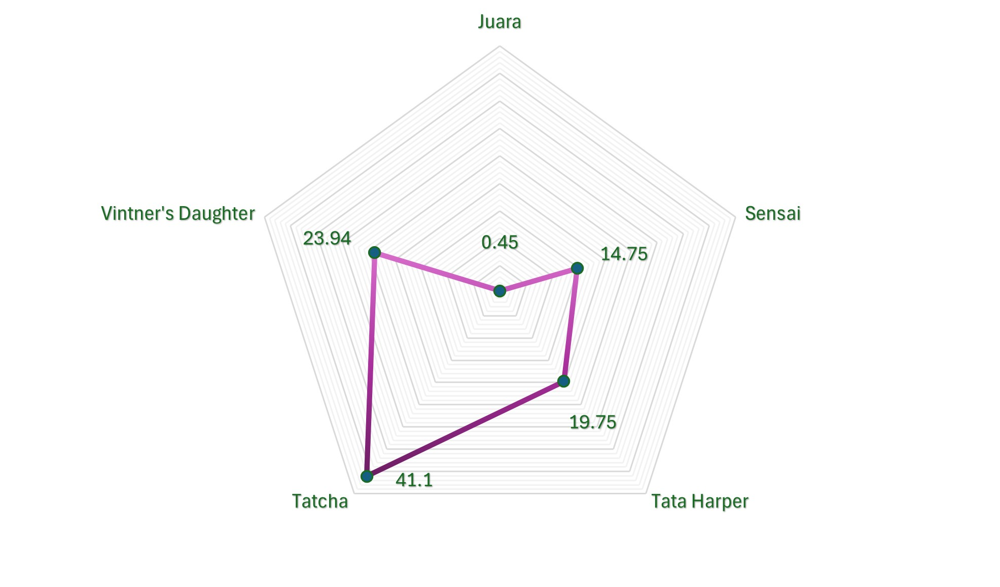
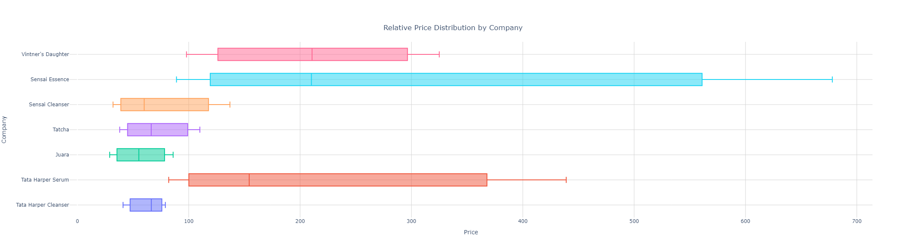

# Data_Analysis_Portfolio

## Projects

### Meyraki Competitor Analysis Project

Project Overview: This competitor analysis examines Meyraki's positioning against five competitors (Juara, Tata Harper, Vintner’s Daughter, Sensai, and Tatcha) across market share, pricing, and target audience segments. The goal is to provide strategic insights for Meyraki to strengthen its competitive edge in the luxury skincare market.

Key Insights:

Market Share & Positioning: Vintner’s Daughter leads with a 24% share, followed by Tatcha (19%) and Tata Harper (20%). Meyraki should explore targeting eco-conscious consumers as Tata Harper has excelled with sustainability-driven marketing.
Unique Selling Propositions (USPs): Competitors rely on culturally rooted ingredients (Juara), advanced technology (Sensai), or minimalistic luxury (Vintner’s Daughter), allowing them to capture specific market segments.
Pricing Strategy: Meyraki can experiment with mid-tier luxury pricing, similar to Juara, to reach a broader consumer base without diluting its premium brand identity.
Recommendations:

Expand Sustainability Messaging: Highlighting sustainable practices will align Meyraki with market trends and attract younger, eco-conscious buyers.
Targeting Unisex Products: Introducing a gender-neutral skincare line could open up a growing male skincare market.
Accessible Luxury: Offering more affordable products (while maintaining luxury status) can help Meyraki tap into the pricing strategy used effectively by Juara and Sensai.

Recommendations:

Expand Sustainability Messaging: Highlighting sustainable practices will align Meyraki with market trends and attract younger, eco-conscious buyers.
Targeting Unisex Products: Introducing a gender-neutral skincare line could open up a growing male skincare market.
Accessible Luxury: Offering more affordable products (while maintaining luxury status) can help Meyraki tap into the pricing strategy used effectively by Juara and Sensai.

Visualisations:
The following visualisations summarise the competitor analysis:

1. Competitor Market Share
This chart illustrates the distribution of market share among key competitors, with Vintner’s Daughter leading the segment.

2. Pricing Strategy Comparison
This chart compares the pricing strategies of competitors, highlighting how Meyraki can position itself in the accessible luxury segment.

3. Customer Segmentation
This visualisation displays how competitors segment their customers by age, gender, and region, offering insights into untapped demographics.

### Time Series & Forcasting
