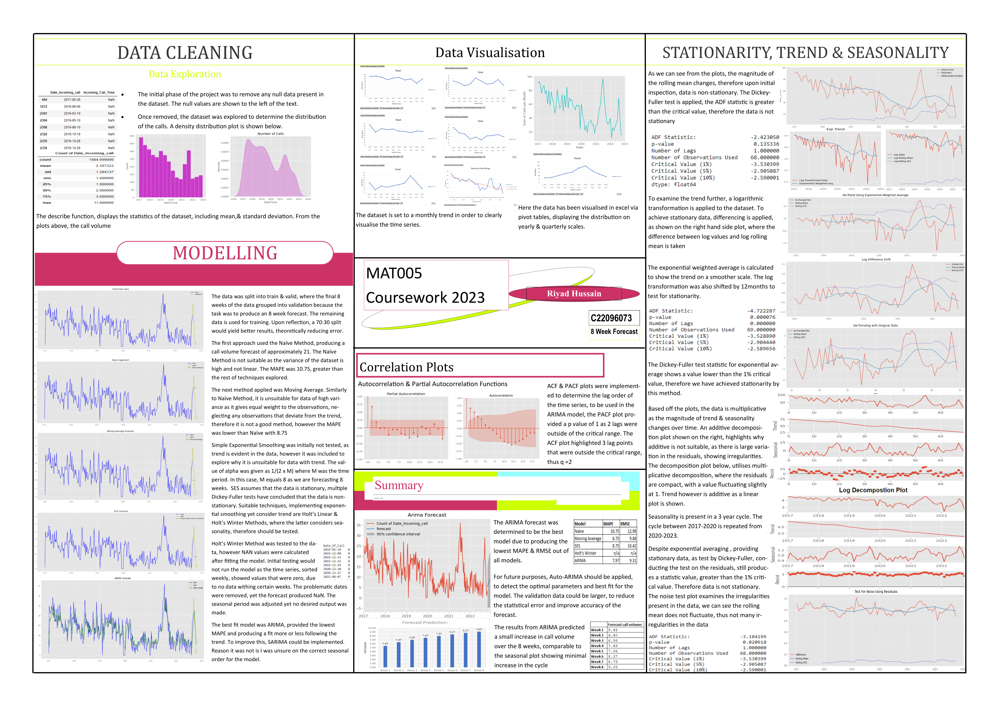

# Data Analysis Portfolio

## Meyraki - Work Sample
Through my internship with luxury-skincare start-up Meyraki, I was tasked in creating a market analysis report, collecting compeititor data through web scraping and developing actionable insights to aid market postion strategies aand product pricing. 
### Meyraki Competitor Analysis Project

Project Overview: This competitor analysis examines Meyraki's positioning against five competitors (Juara, Tata Harper, Vintner’s Daughter, Sensai, and Tatcha) across market share, pricing, and target audience segments. The goal is to provide strategic insights for Meyraki to strengthen its competitive edge in the luxury skincare market. Below documents a breif summary of findings from the analysis report. 

**Key Insights:**

Market Share & Positioning: Vintner’s Daughter leads with a 24% share, followed by Tatcha (19%) and Tata Harper (20%). Meyraki should explore targeting eco-conscious consumers as Tata Harper has excelled with sustainability-driven marketing.
Unique Selling Propositions (USPs): Competitors rely on culturally rooted ingredients (Juara), advanced technology (Sensai), or minimalistic luxury (Vintner’s Daughter), allowing them to capture specific market segments.
Pricing Strategy: Meyraki can experiment with mid-tier luxury pricing, similar to Juara, to reach a broader consumer base without diluting its premium brand identity.

**Visualisations:**
The following visualisations summarise the competitor analysis:  

1. Competitor Market Share:
This chart illustrates the distribution of market share among key competitors, with Vintner’s Daughter leading the segment.

2. Pricing Strategy Comparison:  
This chart compares the pricing distribution of competitors, enabling Meyraki to position itself in an accessible segment.

3. Customer Segmentation:
This visualisation displays how competitors segment their customers by age, gender, and region, offering insights into untapped demographics. A compilation of additional visulisations of competitor price ranges are provided below. 

**Recommendations:**

***Expand Sustainability Messaging:*** Highlighting sustainable practices will align Meyraki with market trends and attract younger, eco-conscious buyers.  
***Targeting Unisex Products:*** Introducing a gender-neutral skincare line could open up a growing male skincare market.  
***Accessible Luxury:*** Offering more affordable products (while maintaining luxury status) can help Meyraki tap into the pricing strategy used effectively by Juara and Sensai.

To determine a suitable price point for ultra-luxury skincare products, Meyraki should consider the average prices of similar products, which range from £60 to £210 or $55 to $210. The company must assess whether its products justify these prices based on their unique formulation, packaging, and brand positioning. A price range between £150 to £300 could reflect exclusivity and premium quality. Given Meyraki's niche product composition, Juara, although not in the ultra-luxury market, is the closest competitor. Ultimately, the price should align with the perceived value of the products and the target market's willingness to pay.

## Time Series & Forcasting
In an academic assignment, the goal was to create a forecasting tool for a charitable ambulance service in Jakarta, which operates 24/7 from four stations. Using historical call data from 01/01/17 to 23/10/22, the assignment involved forecasting weekly call volumes for the period from 24/10/22 to 18/12/22. The project included preliminary data analysis, identifying seasonal trends, and employing various time series models such as Naïve, SES, Holt Linear, Holt-Winters, and ARIMA. The models' accuracy was compared using error statistics like MAPE, and the findings were presented in a detailed poster with numerical and graphical summaries.

The code is attached as a PDF here: [View HTML Document](Data/c22096073_code.html)  

**Key Findings:**

***Data Preprocessing:***  
The dataset contained missing values which were cleaned before analysis.
The data exhibited seasonality, and stationarity was achieved after log transformations and differencing, as validated by the Dickey-Fuller test.  
***Modeling:***  
Naïve Method: Produced a high MAPE (10.75), unsuitable due to high variance.
Moving Average: Improved MAPE (8.75) but was still inadequate due to its equal weighting of observations.
Holt's Winter Method: Faced issues with missing data and produced NaN values despite adjustments to seasonal periods.
ARIMA Model: Selected as the best model with the lowest MAPE and RMSE, accurately capturing the trend and seasonality.  
***Autocorrelation and PACF:***  
These plots were used to determine the lag orders for the ARIMA model, with p=1 and q=2 derived from the PACF and ACF plots, respectively.  
**Recommendations:**  
Implement Auto-ARIMA for more optimized parameter selection.
Increase the validation data size (e.g., 70:30 train/validation split) to reduce forecast errors.
Consider using SARIMA to account for complex seasonal patterns in future analyses.

